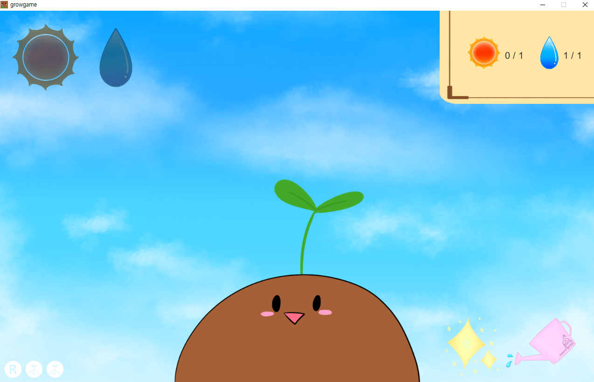
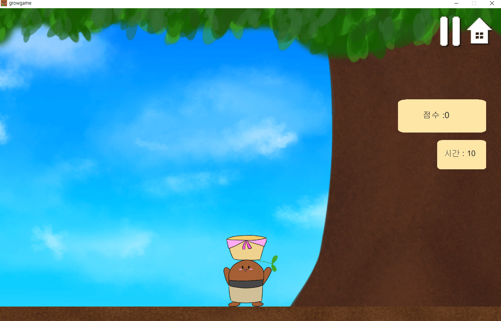
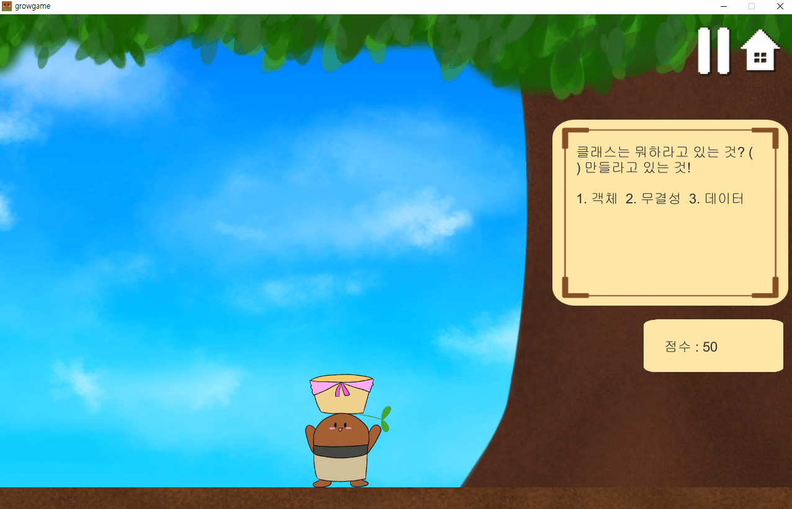
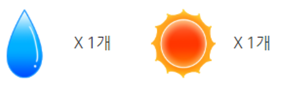
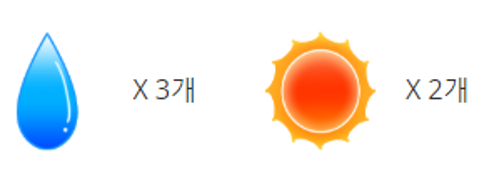

# 토양이 키우기 (Grow Grow)

### 1. 프로젝트 소개

🌱 unity **2017.4.10f1** 사용, **1280 X 800**에 최적화 되어있습니다.

🌱 대학교 3학년 때, 개최된 전시회에 출품한 작품으로, 대학에 입학하여 지금까지 배운 전공 지식들을 정리하기 위해 해당 게임을 만들었습니다.

 

 

### 2. 게임 설명서

🌱 메인화면 

 

 

 

1. 물 아이콘과 해 아이콘을 모아, 토양이의 머리 위에 있는 식물을 **새싹 → 꽃 → 열매**로 키워가는 게입니다.  

   🌱 토양이 성장 모습

   ➡➡

 

   🌱 햇빛, 물 아이콘
          

 

 

2. 해 아이콘 모으는 법

   🌱 정해진 시간(10초) 안에 나무에서 떨어지는 사과를 바구니로 받는 게임으로 사과 하나 당 6점을 얻을 수 있습니다. (해당 게임은 0점 부터 시작합니다.)

   🌱 메인 화면 우측 하단에 있는 반짝이 아이콘을 눌러 게임을 시작할 수 있습니다.

   🌱 50점을 모으면 해 아이콘 1개를 얻을 수 있습니다.

   🌱 반짝이 아이콘  

   

   🌱 게임 화면  

   

    

    

3. 물 아이콘 모으는 법

   🌱 총 5개의 문제가 제공되며,  나무 옆에 있는 문제와 보기를 확인하여 문제에 맞는 보기 번호가 적힌 사과를 바구니로 받으면 점수를 얻을 수 있습니다. 

   🌱 정답인 사과를 받으면 10점을 얻고 , 정답이 아닌 사과를 받으면 10점이 감점 됩니다. (해당 게임은 50점부터 시작합니다.)

   🌱 정답을 맞춰야 다음 문제로 넘어갑니다.

   🌱 100점을 획득하면 물 아이콘 하나를 얻을 수 있습니다.

   🌱 메인 화면 우측 하단에 있는 물뿌리개 아이콘을 눌러 게임을 시작할 수 있습니다.

   🌱 물뿌리개 아이콘  

   

   🌱 게임 화면  

   

 

 

4. 성장 조건

   ⑴ 새싹 → 꽃  

     

   

   ⑵ 꽃 → 열매 

   

    

    

5.  기타

      🌱 아이콘 차는 모습  

      

      🌱 게임 화면 내 일시정지 버튼 및 홈 화면으로 돌아가는 버튼 

      

   

